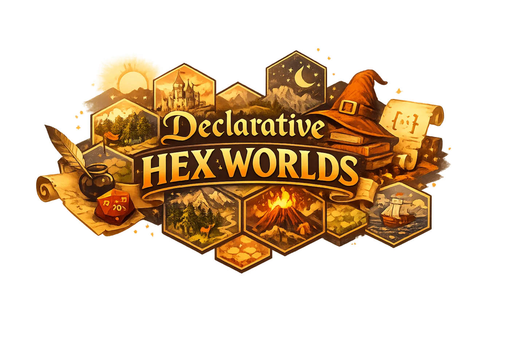

# Declarative, deterministic hex worlds

Build a harbor, procedural forest, multi-depth cliff, or a complete hex map as
data. `declarative-hex-worlds` compiles that intent through recipe, blueprint,
and scenario into a deterministic Koota ECS world that React + Three.js and
canvas-2D renderers can consume.

## Start in three steps

1. Install the package: `pnpm add declarative-hex-worlds`.
2. Bootstrap the CC0 KayKit FREE asset pack: `pnpm exec declarative-hex-worlds bootstrap`.
3. Create a plan with `createGameboardBuilder`, then load it through the runtime
   facade in your renderer.

Same seed, same world: generated boards are deterministic across processes and
platforms. The core remains renderer-free while the optional bindings provide
idiomatic Three.js, React, and canvas-2D integration.

## Explore

- [Getting started](guides/getting-started.md) for the first board.
- [Features](features/index.md) for harbors, stacks, movement, quests, and
  cross-kit composition.
- [Recipes, scenarios, and simulation](guides/recipes-scenarios-and-simulation.md)
  for saved and executable game flows.
- [CLI reference](guides/cli-reference.md) for asset bootstrap, validation, and
  simulation commands.
- [Architecture](about/architecture.md) for the plan-to-runtime model.
- [API reference](reference/README.md) for every published TypeScript symbol.

The KayKit Medieval Hexagon Pack is CC0 artwork by
[Kay Lousberg](https://kaylousberg.com/). The package bootstraps assets instead
of embedding them in the npm tarball, keeping installs and licensing boundaries
clear.
